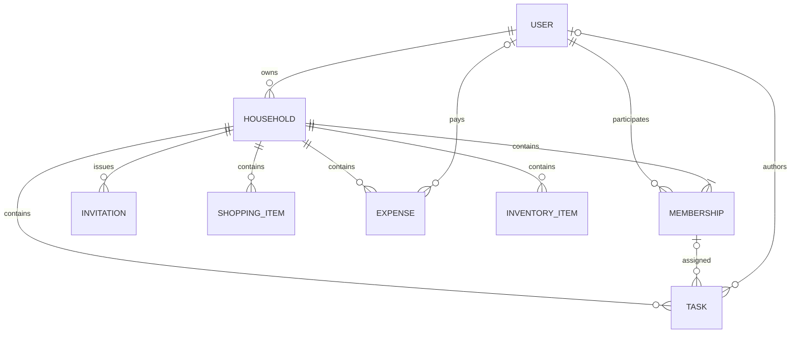

# HouseHoldHub MVP domain model

> **Status:** Accepted  
> **Owner:** Documentation repository; Backend owns executable models and migrations  
> **Last reviewed:** 2026-08-16  
> **Canonical for:** Conceptual entities, relationships, lifecycle rules, and invariants  
> **Supersedes:** The archived [original model](../archive/2026-08-16-design-and-planning/DOMAIN_MODEL_FINAL.md), [corrected model](../archive/2026-08-16-design-and-planning/DOMAIN_MODEL_CORRECTED.md), [ERD](../archive/2026-08-16-design-and-planning/ERD.md), and [system-design](../archive/2026-08-16-design-and-planning/SYSTEM_DESIGN.md) snapshots

## Scope and authority

This document defines the conceptual MVP model. It deliberately does not prescribe Django field declarations, SQL DDL, index definitions, or migration order. Backend models and migrations are authoritative for the executable persistence schema and must implement the invariants recorded here.

The [OpenAPI contract](../api/openapi.yaml) owns wire names, requiredness, and nullability. Product behavior and action permissions belong to the [feature PRDs](../product/prds/README.md) and [permissions matrix](../product/permissions-matrix.md).

## Aggregate and identity view

`Household` is the aggregate and security boundary for collaborative resources. `User` is the authentication principal. `Membership` connects a user to a household and supplies the household role used by authorization.

## Core entities

### User

Purpose: the local HouseHoldHub authentication principal.

Conceptual attributes and relationships:

- UUID identifier;
- email and display identity managed through Django authentication and django-allauth;
- django-allauth verified-email records as the canonical email-verification state;
- django-allauth `SocialAccount`, or its supported equivalent, for provider identity;
- memberships and, optionally, owned households;
- active/disabled/account-lifecycle state.

Invariants:

- A custom UUID Django User model must exist before the first migration.
- Password handling uses Django authentication. The application does not define a bespoke password field.
- Google identity is not stored in a provider-specific `google_id` field.
- Google access or refresh tokens are not persisted unless a future feature needs Google API access.
- A disabled user cannot authenticate; all HouseHoldHub sessions are revoked immediately.
- Disabling retains the User record and therefore does not break ownership or Membership references.
- A User cannot be anonymized or hard-deleted while it owns an active Household. An administrative lifecycle must first resolve every owned Household through household deletion or a separately approved future ownership-transfer mechanism.
- Legal/privacy retention and anonymization behavior remains governed by deferred decision D03.

### Household

Purpose: the aggregate root and authorization boundary for shared household data.

Conceptual attributes:

- UUID identifier;
- name and optional description;
- required `currency_code`, using a supported ISO 4217 code;
- authoritative `owner_id` reference to User;
- a globally unique 8-character uppercase alphanumeric join code;
- creation/update timestamps and nullable deletion timestamp.

Relationships:

- one authoritative owner User;
- one or more Memberships while active, including the matching owner Membership;
- zero or more Invitations, Tasks, ShoppingItems, Expenses, and InventoryItems.

Invariants:

- `Household.owner_id` is authoritative for MVP ownership.
- Exactly one matching Membership for the same household and user has role `owner`.
- Household creation and any administrative repair maintain `owner_id` and the owner Membership atomically.
- The owner Membership cannot be removed. Public ownership transfer is outside MVP scope.
- The Household currency is immutable through the MVP product and API.
- Every MVP Expense in the Household has `Expense.currency_code == Household.currency_code`.
- The active join code is globally unique, owner-readable, and owner-regenerable; it is omitted from generic Household/dashboard representations, and old codes become invalid immediately on regeneration.

Deletion lifecycle:

1. Owner-initiated deletion sets the household deletion marker.
2. Normal access is denied immediately.
3. Memberships and household resources remain stored during a 30-day recovery window.
4. Support/admin may recover the household during that window.
5. An externally scheduled, idempotent purge hard-deletes eligible households and their children after 30 days.

Soft deletion never relies on database cascade. Physical child cascades, where selected in the executable schema, apply only when the Household row is hard-deleted.

### Membership

Purpose: associates a User with a Household and supplies the MVP role.

Conceptual attributes:

- UUID identifier;
- household reference;
- user reference;
- role: `owner` or `member`;
- joined/created timestamp.

Invariants and lifecycle:

- At most one Membership exists for a `(household, user)` pair.
- An active household has the owner Membership required by the Household owner invariant.
- Membership roles cannot be changed through the MVP product or API; public promotion, demotion, and ownership transfer are unavailable.
- Removing a non-owner Membership denies server-side access on every subsequent request.
- Removing the owner Membership is forbidden.
- Resources authored by a removed member remain with the Household.
- A Task assigned through the removed Membership becomes unassigned.
- MVP does not promise to retain or display a removed assignee's name in task history; assignment history is post-MVP.

### Invitation

Purpose: represents an email-address-bound offer to join a Household.

Conceptual attributes:

- UUID identifier;
- household reference;
- normalized recipient email;
- cryptographic hash of a high-entropy bearer token;
- token generation/version identity sufficient to invalidate stale exchanged intents;
- creation and `expires_at` timestamps;
- revocation and consumption state or timestamps.

Invariants and lifecycle:

- Only one pending Invitation exists for a `(household, normalized email)` pair.
- The plaintext bearer token is never persisted server-side.
- Expiration is determined from `expires_at`.
- The token is single-use and email-bound; final acceptance requires the authenticated account's normalized verified email to match.
- Resend rotates the token and invalidates both the previous token and any server-side pending intent bound to its generation.
- Revocation addresses the Invitation by identifier, not by bearer token.
- Acceptance creates a Membership and consumes the Invitation atomically; a duplicate Membership or incompatible state uses the approved `409` API semantics.
- Account authentication and verified-email confirmation precede acceptance.

The non-secret session handoff and fragment-token rules are defined in [ADR-013](adr/ADR-013-invitation-security.md). Household join codes are a separate bearer mechanism and are not Invitation tokens.

### Task

Purpose: a household task or chore.

Conceptual attributes:

- UUID identifier and household reference;
- title, optional description, and optional calendar `due_date`;
- nullable creator reference;
- nullable single-assignee Membership reference;
- completion state, nullable completer reference, and nullable completion timestamp;
- creation/update timestamps.

Invariants and lifecycle:

- A Task has zero or one assignee; there is no MVP assignment association entity.
- When assigned, the Membership and Task must belong to the same Household.
- The guaranteed MVP enforcement mechanism is application/service-layer validation plus comprehensive negative authorization and integrity tests.
- A normal foreign key to Membership does not, by itself, guarantee equality between the Task and Membership household references. A cross-table `CHECK` is not claimed to provide that guarantee.
- A composite database foreign key is optional only if the chosen Django/PostgreSQL implementation represents it cleanly.
- Removing the assignee Membership sets the Task to unassigned.
- Completion and reopening use the same authorization rule. Completion timestamps are set on completion and cleared on reopening.
- MVP uses pure last-write-wins; Task updates do not carry a conflict-detection contract.

### ShoppingItem

Purpose: an item on a Household's shared shopping list.

Conceptual attributes:

- UUID identifier and household reference;
- name and optional quantity/detail text;
- purchased state with nullable purchaser and purchase timestamp;
- nullable creator reference and creation/update timestamps.

Invariants:

- The item belongs to exactly one Household.
- Purchase state may be toggled; clearing it clears purchase attribution for the current state.
- Detailed action permissions are defined only in the canonical permissions matrix.

### Expense

Purpose: a recorded household expense under the MVP single-payer model.

Conceptual attributes:

- UUID identifier and household reference;
- positive integer `amount_minor`;
- immutable ISO 4217 `currency_code`;
- explicit `incurred_on` calendar date;
- category: `Food`, `Utilities`, `Maintenance`, `Entertainment`, or `Other`;
- nullable payer User reference;
- nullable creator User reference and optional description;
- creation/update timestamps.

Invariants and lifecycle:

- `amount_minor > 0` and represents the currency's minor units using the applicable supported ISO currency exponent. The model does not assume every currency has two decimal minor units.
- Backend owns validation and interpretation of the supported ISO 4217 currency semantics.
- `amount_cents` is not a canonical field or concept.
- On creation, `currency_code` is copied from the Household and is immutable. Household currency is also immutable in MVP, so all Household Expense aggregation uses one currency.
- MVP has no currency selector, currency conversion, exchange-rate source, valuation date, or mixed-currency aggregation.
- `incurred_on` is explicitly supplied by the client. The official frontend defaults it to the browser-local calendar date; the backend does not silently derive it from server UTC.
- Payer defaults to the creator and must be an active member of the Household when the Expense is created.
- Payer is immutable after creation.
- The payer reference is nullable and uses `SET NULL` on User deletion. `PROTECT` is not a substitute for payer immutability.
- Single payer is the MVP model. Future expense splitting may require data migration and a dedicated decision.

A future Household currency-change feature requires a product/data-model decision covering history, aggregation, conversion policy, rate source, valuation dates, and reporting.

### InventoryItem

Purpose: a quantity-tracked item in a Household's inventory.

Conceptual attributes:

- UUID identifier and household reference;
- name;
- positive integer quantity;
- optional free-form unit;
- optional category grouping;
- optional location display metadata;
- nullable creator reference and creation/update timestamps.

Invariants:

- Quantity remains positive.
- A decrement below one is rejected and is not interpreted as deletion.
- Category is the MVP grouping dimension; location is display metadata.
- Detailed action permissions are defined only in the canonical permissions matrix.

## Supporting security and delivery records

The selected Django/django-allauth stack supplies or is extended with supporting persistence for:

- verified email ownership;
- linked social-provider identities;
- an indexed user-session registry that supports the approved revocation matrix without device-management UI or continuous activity tracking;
- durable transactional-email delivery status containing only the minimum metadata needed for observability and recovery.

These records support the domain but do not change the eight product entities above. Exact table and field designs belong to Backend models/migrations and compatible framework facilities.

Delivery records must not contain plaintext verification, reset, or invitation tokens; full sensitive URLs; secret-bearing rendered bodies; or unnecessary recipient PII. Provider acceptance is not inbox-delivery confirmation.

## Cross-cutting invariants

### Household scoping

- Every Membership, Invitation, Task, ShoppingItem, Expense, and InventoryItem belongs to one Household.
- Backend reads and mutations are scoped to Households in which the authenticated User has an active Membership.
- PostgreSQL RLS is not an MVP enforcement layer.
- Negative household-isolation and action-authorization tests are required across roles, states, and error cases.

### Attribution and deletion

- Household-owned resources survive ordinary member removal.
- Nullable creator/completer/purchaser/payer references permit a retained resource to survive a later eligible User hard deletion where the executable model requires it.
- Removed task assignment is not an audit-history feature: it becomes unassigned without a canonical promise to display the former assignee.
- Owner-account hard deletion remains blocked until all owned active Households are resolved.

### Expense aggregation

MVP total-expense and per-category totals sum `amount_minor` only within one Household, whose Expense currency is uniform and immutable. The associated `currency_code` must accompany values at the API boundary so the integer's meaning is explicit.

## Deferred model decisions

This model does not resolve D01–D06. In particular, D03 governs legal/privacy retention and D06 governs exact schema/index implementation choices at the approved milestone. Post-MVP assignment history, ownership transfer, household currency changes, expense splitting, optimistic concurrency, and timezone-aware scheduling require separate decisions before becoming canonical.
