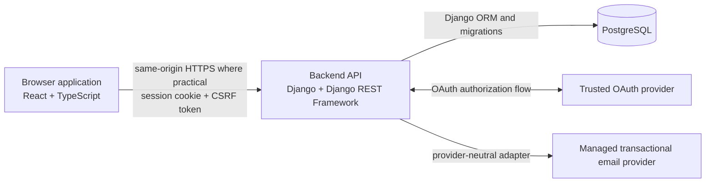

# HouseHoldHub architecture overview

> **Status:** Accepted  
> **Owner:** Documentation repository; Architecture/Engineering stewardship  
> **Last reviewed:** 2026-08-16  
> **Canonical for:** System context, component boundaries, and architectural constraints  
> **Supersedes:** The active architecture role of the [archived system-design snapshot](../archive/2026-08-16-design-and-planning/SYSTEM_DESIGN.md)

## Purpose

HouseHoldHub is a browser-based household collaboration application. The MVP lets authenticated household members manage tasks, a shopping list, expenses, and inventory inside a household security boundary.

This document describes the system shape and the boundaries between its components. It intentionally does not define product behavior, route inventories, executable database schema, deployment-vendor configuration, or detailed security controls. Those belong to the canonical sources in [Documentation boundaries](#documentation-boundaries).

## System context

The official browser application communicates with the backend through the versioned REST contract in [OpenAPI](../api/openapi.yaml). The backend is the only component that reads or writes application persistence. Google is the approved MVP social-identity provider and is integrated through django-allauth. Transactional email remains behind a backend-owned provider-neutral adapter; the exact managed email and deployment vendors remain deferred until the approved vendor-selection milestones.

## Repository boundaries

HouseHoldHub has five first-class repositories:

| Repository | Responsibility |
|---|---|
| Backend | Django/DRF service, executable models and migrations, authorization enforcement, provider-neutral email adapter, service Dockerfile, and service workflow |
| Frontend | React application, browser flows, client-side API integration, service Dockerfile, and service workflow |
| Infrastructure | Deployment manifests, runtime-target configuration, managed-service provisioning, credentials, and secret rotation |
| Automation | Reusable automation, shared policy and pipeline assets, integration-test support, fixtures, and secret scanning |
| Documentation | Shared product, architecture, API, security, quality, and planning contracts |

[ADR-009](adr/ADR-009-five-repository-topology.md) records the topology decision and cross-repository consequences.

## Runtime architecture

- The frontend is a React 19 + TypeScript single-page application built with Vite.
- The backend is Python 3.14 + Django 5.2 LTS with Django REST Framework.
- PostgreSQL is the MVP system of record. Django models and migrations are the executable persistence schema.
- Authentication uses server-side, database-backed Django sessions. Redis and JWT authentication are not MVP dependencies.
- The browser/API contract uses session authentication and Django CSRF protection. The detailed contract lives in the security model and OpenAPI.
- Transactional email uses a bounded synchronous provider call after domain-state commit; no queue, Redis, Celery, or dedicated worker is introduced solely for email.
- Local orchestration uses Docker Compose. Service repositories own their images; Infrastructure owns deployment composition and runtime targets.
- GitHub Actions is the CI/CD technology.

Exact dependency versions belong to repository manifests and committed lockfiles. Deployment, monitoring, and email-provider selections plus legal/privacy retention and disaster-recovery settings not already fixed by the baseline remain governed by the approved deferred decisions and their resolution deadlines. The approved 30-day Household recovery window is not deferred.

## Data and trust boundaries

### Household isolation

Household membership is the authorization boundary. Every household-owned resource is accessed through a household-scoped backend query followed by action-specific authorization. Objects that do not exist or are outside the caller's scope are reported as not found; a known in-household action denied by role or authorship is forbidden.

PostgreSQL row-level security is not part of the MVP. Isolation is guaranteed by backend scoping, authorization checks, and comprehensive negative isolation tests.

### Ownership

`Household.owner_id` is the authoritative MVP owner reference. A matching owner-role Membership must exist and be maintained atomically. The owner Membership cannot be removed, and public ownership transfer is outside MVP scope. [ADR-012](adr/ADR-012-ownership-and-authorization.md) defines the invariant and owner lifecycle.

### Deletion

Household deletion is a soft delete that immediately denies normal access while preserving memberships and household resources for a 30-day support/admin recovery window. An idempotent scheduled purge hard-deletes eligible households after the window.

An account may be disabled without removing its User record. An owner cannot be anonymized or hard-deleted while an active Household still references that user; the administrative lifecycle must first resolve each owned Household. Legal and privacy retention behavior remains subject to deferred decision D03.

## Collaboration and consistency

- MVP synchronization is request/response REST with client cache invalidation and refetch; there is no WebSocket or server-sent-event requirement.
- Mutable resources use pure last-write-wins for MVP. The API does not promise optimistic-concurrency `409 Conflict` responses.
- A Task has zero or one assignee. Same-household assignment is guaranteed through service-layer validation and negative integrity tests. A normal foreign key or cross-table `CHECK` is not claimed to guarantee the invariant.
- Member revocation takes effect on every subsequent server request. Browser-cached data may disappear on normal invalidation, refetch, or denied-response handling.

## Documentation boundaries

| Topic | Canonical source |
|---|---|
| Product scope and behavior | [Umbrella and feature PRDs](../product/prds/README.md) |
| Readable product authorization | [Permissions matrix](../product/permissions-matrix.md) |
| Durable architecture decisions | [ADR index](adr/README.md) |
| Approved technology families and ownership | [Technology baseline](technology-baseline.md) |
| Conceptual entities and invariants | [Domain model](domain-model.md) |
| Routes, request/response schemas, and wire errors | [OpenAPI](../api/openapi.yaml) |
| Authentication, CSRF, token, isolation, and audit controls | [Security model](../security/security-model.md) |
| Executable persistence schema | Backend models and migrations |
| Exact dependencies | Repository manifests and committed lockfiles |
| Deployment configuration | Infrastructure repository |
| Execution state and issue counts | Live GitHub issues |

No architecture document should maintain a competing route inventory, permission table, exact dependency lock, or executable schema.

## Architectural constraints and deferred decisions

The MVP deliberately excludes PostgreSQL RLS, real-time transport, Redis, message brokers, and an email queue added solely for transactional email. These are not prohibited forever; adoption requires an approved later decision and demonstrated need.

The baseline's D01–D06 decisions remain deferred to their recorded deadlines. In particular, this overview does not choose exact password/rate-limit constants, managed vendors, legal retention rules, recovery targets, delivery schedules, or exact package/index versions.
