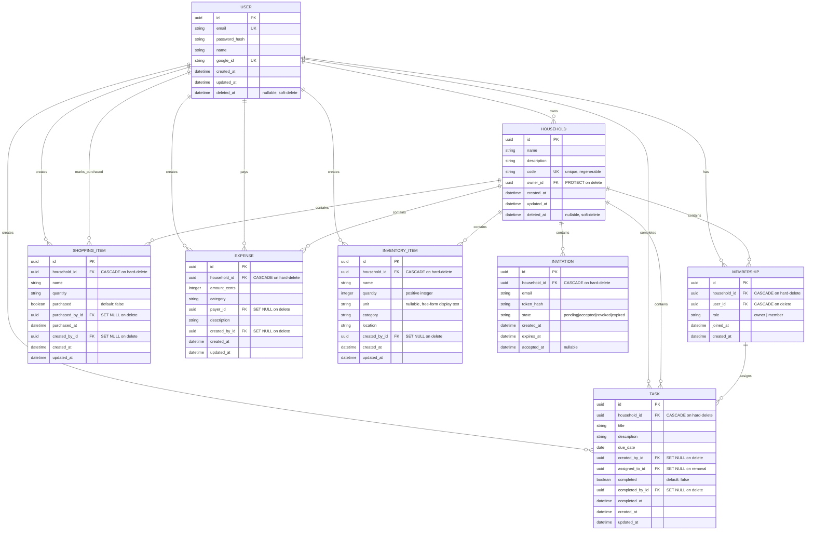

# HouseHoldHub MVP - Entity-Relationship Diagram

**Date:** August 16, 2026  
**Source:** Approved domain model  
**Status:** Ready for database schema generation

---

## ERD in Mermaid Format



---

## Cardinalities & Key Relationships

### Primary Relationships

```
User : Household = 1 : N
  └─ User.id → Household.owner_id (PROTECT)
  └─ One user owns many households
  └─ Cannot delete user if owns households

User : Membership = 1 : N
  └─ User.id → Membership.user_id (CASCADE)
  └─ User belongs to multiple households via memberships

Household : Membership = 1 : N
  └─ Household.id → Membership.household_id (CASCADE on hard-delete)
  └─ One household has multiple members

Membership : Task = 1 : N
  └─ Membership.id → Task.assigned_to_id (SET NULL)
  └─ One membership can have many tasks assigned
  └─ Unassign if member removed from household

Household : Task = 1 : N
  └─ Household.id → Task.household_id (CASCADE on hard-delete)
  
Household : ShoppingItem = 1 : N
  └─ Household.id → ShoppingItem.household_id (CASCADE on hard-delete)

Household : Expense = 1 : N
  └─ Household.id → Expense.household_id (CASCADE on hard-delete)

Household : InventoryItem = 1 : N
  └─ Household.id → InventoryItem.household_id (CASCADE on hard-delete)

Household : Invitation = 1 : N
  └─ Household.id → Invitation.household_id (CASCADE on hard-delete)
```

---

## Key Constraints

### Unique Constraints
- User.email (globally unique)
- Household.code (globally unique)
- UNIQUE(Membership.household_id, Membership.user_id)

### Foreign Key Constraints

| FK | Parent | Child | Behavior | Notes |
|----|--------|-------|----------|-------|
| Household.owner_id | User | Household | PROTECT | Cannot delete user if owns household |
| Membership.household_id | Household | Membership | CASCADE | Only cascade on hard-delete |
| Membership.user_id | User | Membership | CASCADE | Membership deleted if user deleted |
| Task.household_id | Household | Task | CASCADE | Only cascade on hard-delete |
| Task.created_by_id | User | Task | SET NULL | Preserve task if creator deleted |
| Task.assigned_to_id | Membership | Task | SET NULL | Unassign if member removed |
| Task.completed_by_id | User | Task | SET NULL | Preserve completion record |
| ShoppingItem.household_id | Household | ShoppingItem | CASCADE | Only cascade on hard-delete |
| ShoppingItem.created_by_id | User | ShoppingItem | SET NULL | Preserve item if creator deleted |
| ShoppingItem.purchased_by_id | User | ShoppingItem | SET NULL | Preserve purchase history |
| Expense.household_id | Household | Expense | CASCADE | Only cascade on hard-delete |
| Expense.created_by_id | User | Expense | SET NULL | Preserve expense if creator deleted |
| Expense.payer_id | User | Expense | SET NULL | Preserve payer information |
| InventoryItem.household_id | Household | InventoryItem | CASCADE | Only cascade on hard-delete |
| InventoryItem.created_by_id | User | InventoryItem | SET NULL | Preserve item if creator deleted |
| Invitation.household_id | Household | Invitation | CASCADE | Only cascade on hard-delete |

### Check Constraints

```sql
-- Task role in Membership
ALTER TABLE task ADD CONSTRAINT task_assigned_to_same_household
  CHECK (assigned_to_id IS NULL OR 
    EXISTS (SELECT 1 FROM membership 
            WHERE membership.id = task.assigned_to_id 
            AND membership.household_id = task.household_id));

-- Invitation state values
ALTER TABLE invitation ADD CONSTRAINT invitation_state_enum
  CHECK (state IN ('pending', 'accepted', 'revoked', 'expired'));

-- Membership role values
ALTER TABLE membership ADD CONSTRAINT membership_role_enum
  CHECK (role IN ('owner', 'member'));

-- Expense category values
ALTER TABLE expense ADD CONSTRAINT expense_category_enum
  CHECK (category IN ('Food', 'Utilities', 'Maintenance', 'Entertainment', 'Other'));

-- Amount must be non-negative
ALTER TABLE expense ADD CONSTRAINT expense_amount_positive
  CHECK (amount_cents >= 0);

-- Inventory quantity must be a positive integer
ALTER TABLE inventory_item ADD CONSTRAINT inventory_quantity_positive
  CHECK (quantity >= 1);
```

### Indexes (for Performance)

```sql
-- Foreign keys
CREATE INDEX idx_household_owner ON household(owner_id);
CREATE INDEX idx_membership_household ON membership(household_id);
CREATE INDEX idx_membership_user ON membership(user_id);
CREATE INDEX idx_task_household ON task(household_id);
CREATE INDEX idx_task_created_by ON task(created_by_id);
CREATE INDEX idx_task_assigned_to ON task(assigned_to_id);
CREATE INDEX idx_task_completed_by ON task(completed_by_id);
CREATE INDEX idx_shopping_household ON shopping_item(household_id);
CREATE INDEX idx_shopping_created_by ON shopping_item(created_by_id);
CREATE INDEX idx_shopping_purchased_by ON shopping_item(purchased_by_id);
CREATE INDEX idx_expense_household ON expense(household_id);
CREATE INDEX idx_expense_created_by ON expense(created_by_id);
CREATE INDEX idx_expense_payer ON expense(payer_id);
CREATE INDEX idx_inventory_household ON inventory_item(household_id);
CREATE INDEX idx_inventory_created_by ON inventory_item(created_by_id);
CREATE INDEX idx_invitation_household ON invitation(household_id);

-- Filtering & sorting
CREATE INDEX idx_user_email ON "user"(email);
CREATE INDEX idx_household_code ON household(code);
CREATE INDEX idx_user_deleted ON "user"(deleted_at);
CREATE INDEX idx_household_deleted ON household(deleted_at);
CREATE INDEX idx_task_completed ON task(completed);
CREATE INDEX idx_task_due_date ON task(due_date);
CREATE INDEX idx_shopping_purchased ON shopping_item(purchased);
CREATE INDEX idx_expense_category ON expense(category);
CREATE INDEX idx_membership_role ON membership(role);
CREATE INDEX idx_invitation_state ON invitation(state);

-- Unique constraints
CREATE UNIQUE INDEX idx_user_email_unique ON "user"(email);
CREATE UNIQUE INDEX idx_household_code_unique ON household(code);
CREATE UNIQUE INDEX idx_membership_unique ON membership(household_id, user_id);
```

---

## Deletion Behavior Summary

### Soft-Delete (Reversible, Recoverable)

**Operation:** Set `deleted_at = now()`

**Entities:**
- User (soft-delete only; personal data preserved for recovery period)
- Household (soft-delete only; data preserved during 30-day recovery period)

**During soft-delete:**
- No cascade deletions occur
- All related data remains in database
- Users lose access immediately (queries filter by deleted_at IS NULL)
- Data recoverable by clearing deleted_at timestamp

### Hard-Delete (Irreversible, Permanent)

**Operation:** Physical deletion of records (only after soft-delete retention period expires)

**Cascade Hard-Delete:**
- Household hard-delete → cascades to:
  - All Membership records (hard-delete)
  - All Task records (hard-delete)
  - All ShoppingItem records (hard-delete)
  - All Expense records (hard-delete)
  - All InventoryItem records (hard-delete)
  - All Invitation records (hard-delete)

**Set Null on Hard-Delete (Preserve Content):**
- Task.created_by_id = NULL (task remains; attributed to "deleted user")
- Task.completed_by_id = NULL (preserve completion timestamp)
- ShoppingItem.created_by_id = NULL (item remains)
- ShoppingItem.purchased_by_id = NULL (preserve purchase history)
- Expense.created_by_id = NULL (expense remains)
- Expense.payer_id = NULL (preserve payer information)
- InventoryItem.created_by_id = NULL (item remains)

**Protect (Prevent Deletion):**
- User.id (if Household.owner_id references user): PROTECT
  - Cannot delete user if they own households
  - User must transfer ownership before account deletion

---

## Household Scope Enforcement

**All data scoped by household_id:**

```sql
-- Query pattern for user access
SELECT * FROM entity
WHERE household_id IN (
  SELECT household_id FROM membership WHERE user_id = $1
)
AND deleted_at IS NULL;
```

This pattern applied to:
- Task (only user's household tasks visible)
- ShoppingItem (only user's household items visible)
- Expense (only user's household expenses visible)
- InventoryItem (only user's household items visible)
- Membership (only user's household members visible)
- Invitation (only user's household invitations visible)

---

## Special Relationships

### Task Assignment (Single Assignee Model)

```
Task.assigned_to_id → Membership (not User)
  └─ Single nullable reference to Membership
  └─ Ensures task assignment is scoped to same household
  └─ If member removed: SET NULL (task becomes unassigned)
  └─ Prevents cross-household task assignment
```

### Expense Payer (Defaults to Creator)

```
Expense.payer_id (nullable, defaults to created_by_id on creation)
  └─ Can differ from creator (different person paid)
  └─ Immutable after creation (prevent historical changes)
  └─ If payer deleted: SET NULL (preserve payer information)
```

### Invitation Lifecycle

```
Invitation.state transitions:
  pending → accepted [on user action]
  pending → revoked [on owner action]
  pending → expired [after expires_at]
  
  (only one transition per invitation; not reversible)
```

---

## Data Types

| Column | Type | Notes |
|--------|------|-------|
| *_id | UUID | Primary keys; unique identifiers |
| email | TEXT | User email; unique constraint |
| password_hash | TEXT | bcrypt/Argon2 hash |
| name | TEXT | Display name |
| google_id | TEXT | nullable; OAuth identifier |
| title, name, description | TEXT | Variable-length text |
| code | VARCHAR(50) | Household join code |
| role | VARCHAR(20) | Enum: owner, member |
| state | VARCHAR(20) | Enum: pending, accepted, revoked, expired |
| category | VARCHAR(50) | Enum: Food, Utilities, Maintenance, Entertainment, Other |
| amount_cents | INTEGER | Amount in cents; no decimals |
| quantity (ShoppingItem) | TEXT or VARCHAR(100) | Flexible quantity string (e.g. "2 lbs") |
| quantity (InventoryItem) | INTEGER | Positive integer count |
| unit (InventoryItem) | VARCHAR(50), nullable | Free-form display text (e.g. "boxes", "bottles") |
| completed, purchased | BOOLEAN | Status flags; default false |
| due_date | DATE | nullable; task deadline |
| *_at | TIMESTAMP WITH TIME ZONE | Timestamps; UTC |
| deleted_at | TIMESTAMP WITH TIME ZONE | nullable; soft-delete marker |

---

## Django Model Mapping

Each entity maps directly to a Django Model:

```python
# models/user.py
class User(models.Model):
    id = models.UUIDField(primary_key=True, default=uuid.uuid4)
    email = models.EmailField(unique=True)
    password_hash = models.CharField(max_length=255)
    name = models.CharField(max_length=255)
    google_id = models.CharField(max_length=255, null=True, blank=True, unique=True)
    created_at = models.DateTimeField(auto_now_add=True)
    updated_at = models.DateTimeField(auto_now=True)
    deleted_at = models.DateTimeField(null=True, blank=True)

# models/household.py
class Household(models.Model):
    id = models.UUIDField(primary_key=True, default=uuid.uuid4)
    name = models.CharField(max_length=255)
    description = models.TextField(blank=True)
    code = models.CharField(max_length=50, unique=True)
    owner = models.ForeignKey(User, on_delete=models.PROTECT)
    created_at = models.DateTimeField(auto_now_add=True)
    updated_at = models.DateTimeField(auto_now=True)
    deleted_at = models.DateTimeField(null=True, blank=True)

# models/membership.py
class Membership(models.Model):
    ROLE_CHOICES = [('owner', 'Owner'), ('member', 'Member')]
    id = models.UUIDField(primary_key=True, default=uuid.uuid4)
    household = models.ForeignKey(Household, on_delete=models.CASCADE)
    user = models.ForeignKey(User, on_delete=models.CASCADE)
    role = models.CharField(max_length=20, choices=ROLE_CHOICES)
    joined_at = models.DateTimeField(auto_now_add=True)
    created_at = models.DateTimeField(auto_now_add=True)
    
    class Meta:
        unique_together = [('household', 'user')]

# models/invitation.py
class Invitation(models.Model):
    STATE_CHOICES = [
        ('pending', 'Pending'),
        ('accepted', 'Accepted'),
        ('revoked', 'Revoked'),
        ('expired', 'Expired')
    ]
    id = models.UUIDField(primary_key=True, default=uuid.uuid4)
    household = models.ForeignKey(Household, on_delete=models.CASCADE)
    email = models.EmailField()
    token_hash = models.CharField(max_length=255, unique=True)
    state = models.CharField(max_length=20, choices=STATE_CHOICES)
    created_at = models.DateTimeField(auto_now_add=True)
    expires_at = models.DateTimeField()
    accepted_at = models.DateTimeField(null=True, blank=True)

# models/task.py
class Task(models.Model):
    id = models.UUIDField(primary_key=True, default=uuid.uuid4)
    household = models.ForeignKey(Household, on_delete=models.CASCADE)
    title = models.CharField(max_length=255)
    description = models.TextField(blank=True)
    due_date = models.DateField(null=True, blank=True)
    created_by = models.ForeignKey(User, on_delete=models.SET_NULL, null=True, blank=True)
    assigned_to = models.ForeignKey(Membership, on_delete=models.SET_NULL, null=True, blank=True)
    completed = models.BooleanField(default=False)
    completed_by = models.ForeignKey(User, on_delete=models.SET_NULL, null=True, blank=True, related_name='completed_tasks')
    completed_at = models.DateTimeField(null=True, blank=True)
    created_at = models.DateTimeField(auto_now_add=True)
    updated_at = models.DateTimeField(auto_now=True)

# models/shopping_item.py
class ShoppingItem(models.Model):
    id = models.UUIDField(primary_key=True, default=uuid.uuid4)
    household = models.ForeignKey(Household, on_delete=models.CASCADE)
    name = models.CharField(max_length=255)
    quantity = models.CharField(max_length=100, null=True, blank=True)
    purchased = models.BooleanField(default=False)
    purchased_by = models.ForeignKey(User, on_delete=models.SET_NULL, null=True, blank=True, related_name='marked_purchased_items')
    purchased_at = models.DateTimeField(null=True, blank=True)
    created_by = models.ForeignKey(User, on_delete=models.SET_NULL, null=True, blank=True)
    created_at = models.DateTimeField(auto_now_add=True)
    updated_at = models.DateTimeField(auto_now=True)

# models/expense.py
class Expense(models.Model):
    CATEGORY_CHOICES = [
        ('Food', 'Food'),
        ('Utilities', 'Utilities'),
        ('Maintenance', 'Maintenance'),
        ('Entertainment', 'Entertainment'),
        ('Other', 'Other')
    ]
    id = models.UUIDField(primary_key=True, default=uuid.uuid4)
    household = models.ForeignKey(Household, on_delete=models.CASCADE)
    amount_cents = models.IntegerField()
    category = models.CharField(max_length=50, choices=CATEGORY_CHOICES)
    payer = models.ForeignKey(User, on_delete=models.SET_NULL, null=True, blank=True)
    description = models.TextField(blank=True)
    created_by = models.ForeignKey(User, on_delete=models.SET_NULL, null=True, blank=True, related_name='created_expenses')
    created_at = models.DateTimeField(auto_now_add=True)
    updated_at = models.DateTimeField(auto_now=True)

# models/inventory_item.py
class InventoryItem(models.Model):
    id = models.UUIDField(primary_key=True, default=uuid.uuid4)
    household = models.ForeignKey(Household, on_delete=models.CASCADE)
    name = models.CharField(max_length=255)
    quantity = models.PositiveIntegerField(validators=[MinValueValidator(1)])
    unit = models.CharField(max_length=50, null=True, blank=True)
    category = models.CharField(max_length=100, null=True, blank=True)
    location = models.CharField(max_length=255, null=True, blank=True)
    created_by = models.ForeignKey(User, on_delete=models.SET_NULL, null=True, blank=True)
    created_at = models.DateTimeField(auto_now_add=True)
    updated_at = models.DateTimeField(auto_now=True)
```

---

## ERD Generation Instructions

### From This Document:
1. Use the Mermaid diagram above for visual representation
2. Use the SQL constraints for database schema generation
3. Use the Django model code for Django project implementation
4. All relationships, cardinalities, and constraints defined above

### For Database:
```bash
# Django migration generation
python manage.py makemigrations
python manage.py migrate
```

### For API:
See OpenAPI specification document for endpoint design derived from this ERD.

---

