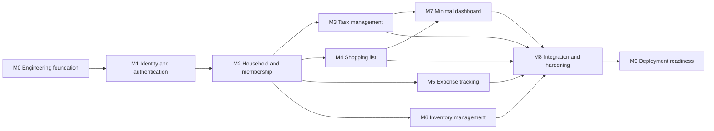

# HouseHoldHub MVP Implementation Plan

> **Status:** Accepted  
> **Owner:** Backend, Frontend, Infrastructure, Automation, and Documentation repositories  
> **Last reviewed:** 2026-08-16  
> **Canonical for:** Relative MVP delivery sequence, dependencies, and milestone outcomes  
> **Supersedes:** The archived [original](../archive/2026-08-16-design-and-planning/IMPLEMENTATION_PLAN.md) and [revised](../archive/2026-08-16-design-and-planning/IMPLEMENTATION_PLAN_REVISED.md) implementation-plan snapshots

## Authority and limits

This plan sequences the approved MVP. It does not define product behavior, wire contracts, exact dependency versions, live issue status, staffing, or a calendar commitment.

- Product scope comes from [`product/prds/`](../product/prds/README.md).
- Authorization comes from the [permissions matrix](../product/permissions-matrix.md).
- Architecture comes from accepted [ADRs](../architecture/adr/README.md) and the [domain model](../architecture/domain-model.md).
- Routes and schemas come only from [`api/openapi.yaml`](../api/openapi.yaml).
- Quality and launch evidence come from [`quality/`](../quality/release-acceptance.md).
- Live GitHub issues and milestones own current work, issue count, assignment, and status.

The plan uses milestone identifiers only as dependency labels. Week estimates from historical plans are not commitments and are not carried forward.

## Delivery shape

M3 through M6 may proceed in parallel after M2. The MVP dashboard depends on households, tasks, and shopping—not expense or inventory widgets. All feature streams converge at M8.

## M0 — Engineering foundation

### Outcomes

- Backend scaffold follows the approved Python 3.14, Django 5.2 LTS, Django REST Framework, PostgreSQL, and custom-User-before-first-migration baseline.
- Frontend scaffold follows React 19, TypeScript, Vite, npm, native CSS Modules/custom properties, Vitest, and React Testing Library.
- Each service owns its Dockerfile and repository-local GitHub Actions workflow entry points.
- Infrastructure provides the full-stack local runtime/deployment-manifest boundary.
- Automation provides reusable pipeline/test/policy assets.
- Documentation publishes the versioned standalone OpenAPI contract and cross-repository governance.
- Contract syntax, generation compatibility, lint/type/test entry points, and secret scanning can be executed in CI once manifests define them.

### Decision gate

D06 selects compatible patch versions, package/lock strategy, database driver, and exact lint/format tool configuration during scaffolding. Documentation does not preempt repository manifests.

## M1 — Identity and authentication

### Outcomes

- Custom UUID User, Django authentication, django-allauth verified-email state, and provider identity relationship exist from the first migration.
- Email/password signup has a restricted pre-verification lifecycle and rate-limited resend/recovery.
- Login, logout, password reset/change, CSRF bootstrap, and authenticated identity behavior match OpenAPI.
- Google OAuth validates state and trusted verified-email claims.
- Existing-email collisions use recent reauthentication and explicit account linking; no provider-specific User field or stored Google API token is introduced.
- PostgreSQL-backed sessions and the indexed user-session registry enforce the approved revocation matrix.
- Provider-neutral transactional email commits domain state before the bounded `on_commit` submission attempt and records durable minimal delivery status.
- Frontend auth, verification, reset, OAuth, protected-route, and recoverable delivery states are present.

### Decision gates

- D01 supplies safe password/reset/rate-limit launch defaults before implementation and contract generation; review/lock them by M8.
- D02 selects and provisions the managed email provider before email integration.
- D03 must be resolved before any real personal data or real-email staging data is processed.

## M2 — Household, membership, and invitations

### Outcomes

- Household requires one immutable MVP ISO 4217 currency and a unique eight-character uppercase alphanumeric join code.
- Household creation atomically creates authoritative `owner_id` state and matching owner Membership.
- Membership enforces one user/household relationship and the owner-removal prohibition.
- Owner/member behavior matches the permissions matrix and every request is household scoped.
- No PostgreSQL RLS claim or invalid cross-table `CHECK` is used as the isolation guarantee.
- Email invitations have one pending invitation per household/normalized email, 30-day expiry, fragment verifier exchange, generation-bound server intent, verified-email match, safe preview, explicit atomic acceptance, resend rotation, and owner revoke by identifier.
- Join-code read/regenerate is owner-only; join attempts are uniform and rate-limited.
- Household soft deletion immediately denies access, preserves children for 30 days, supports admin recovery, and is purged idempotently by a scheduled command.
- Frontend supports household create/select/switch, member/invitation management, fragment landing/handoff, and join by code.

## M3 — Task management

### Outcomes

- Task supports title, optional description, optional due date, completion state, creator, and zero-or-one Membership assignee.
- Central write validation rejects an assignee outside the task household.
- Create/edit/assign/delete/complete/reopen follows the canonical permissions matrix, including any-member completion/reopen for unassigned tasks.
- Removed assignee becomes unassigned; assignment history is post-MVP.
- Last-write-wins is implemented without optimistic-concurrency fields or conflict responses.
- Frontend covers task lists, forms, assignment, completion/reopen, confirmation, and error states.

## M4 — Shopping list

### Outcomes

- Members create/edit/toggle items; creator/owner single-delete rules apply.
- Any member can clear purchased items through an explicit confirmation flow.
- Shopping list and pending-count summaries remain household scoped and refresh through mutation response plus query invalidation/refetch.
- Frontend covers pending/purchased states, bulk clear, and authorization loss.

## M5 — Expense tracking

### Outcomes

- Expense stores positive integer `amount_minor`, immutable copied Household `currency_code`, approved category, optional description, explicit `incurred_on`, creator, and nullable immutable payer.
- Official frontend initializes `incurred_on` from the browser-local calendar and sends it explicitly.
- Payer defaults to creator and must be an active household member at creation; User deletion sets payer null.
- Household currency is immutable through the MVP product/API, so total and per-category aggregation is same-currency integer arithmetic with explicit currency context.
- No per-expense currency selection, FX conversion, expense splitting, or expense dashboard widget is introduced.
- Frontend covers create/edit/delete, date/category filters, same-currency totals, and validation/error states.

## M6 — Inventory management

### Outcomes

- Inventory item supports name, positive integer quantity, optional unit/category/location metadata, creator, and household scope.
- Category grouping is basic MVP presentation; location remains display metadata.
- Decrement below one is rejected rather than interpreted as deletion.
- Any member creates/edits and creator/owner deletes.
- Frontend covers grouped display, forms, decrement validation, and authorization states.

## M7 — Minimal dashboard

### Outcomes

- The dashboard contract requires client-supplied `as_of=YYYY-MM-DD`; the official frontend derives it from the browser-local calendar.
- It returns household identity/member summary, complete incomplete-task count, at most three dated tasks overdue/due today/due through `as_of + 7`, shopping pending count, and approved quick actions.
- Preview ordering is deterministic; undated tasks remain in the complete pending count but not the preview.
- Expense and inventory widgets, analytics, activity feeds, and reports are absent.
- Household plus `as_of` participate in frontend query identity.

## M8 — Integration and hardening

### Outcomes

- All journeys in [release acceptance](../quality/release-acceptance.md) pass across repositories.
- OpenAPI syntax, requiredness/nullability, security, error semantics, and generated client compatibility are verified.
- Complete authorization and cross-household negative matrices pass.
- CSRF, OAuth collision/linking, session revocation, invitation replay/rotation, logging redaction, join-code abuse, email enumeration/failure, and lifecycle tests pass.
- Accessibility evidence covers WCAG 2.1 AA outcomes.
- Coverage is reported without an unsupported threshold; no arbitrary test count is used.
- Representative performance observations may establish a baseline, but unsupported historical thresholds do not block release.

### Decision gate

D01 authentication constants are reviewed/locked. Performance-only indexes follow representative queries/data and query-plan evidence under D06.

## M9 — Deployment readiness

### Outcomes

- Infrastructure provisions the selected runtime target, managed PostgreSQL, secret integration, deployment manifests, migrations, and recovery configuration.
- Automation and service repositories provide production build/deploy/smoke/security workflow entry points.
- Health/readiness, structured redacted logging, request correlation, error tracking, backup/restore, rollback, household purge, session cleanup, critical audit events, and minimal executable runbooks are demonstrated.
- Launch and rollback evidence satisfies [release acceptance](../quality/release-acceptance.md).

### Decision gates

- D02 selects deployment, secret-store, and monitoring providers before provisioning/launch.
- D03 constrains production providers and retention before real personal data.
- D04 defines numeric RTO/RPO, alerts, severity, ownership, and escalation after D02/D03 and before launch sign-off.

## Cross-repository contract workflow

1. Documentation changes the standalone OpenAPI source.
2. Backend and Frontend review breaking changes.
3. Contract validation and generated-artifact compatibility run before merge.
4. Backend implements the versioned contract and executable schema.
5. Frontend consumes generated types/client behavior rather than a hand-maintained duplicate.
6. Infrastructure and Automation coordinate deployment or pipeline changes where required.

Other documents do not maintain route inventories.

## Release acceptance

Milestone completion is evidence-based, not issue-count based. M9 requires all applicable journeys and operational evidence in [`quality/release-acceptance.md`](../quality/release-acceptance.md). A milestone may contain any number of live issues as the team decomposes work.

## Schedule

No calendar start, staffing model, or delivery commitment is approved. D05 is resolved only after named staffing/capacity, a start date, approved scope updates, and re-estimation. Until then, this dependency plan—not historical week labels—is the only planning baseline.
